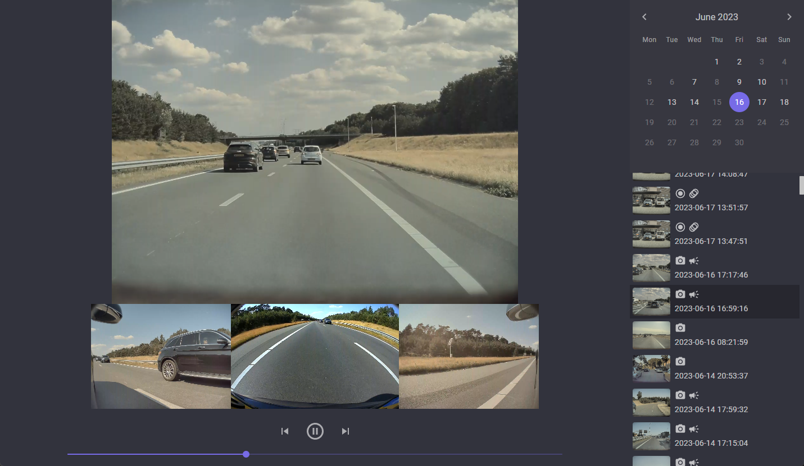

# TeslaCamPlayer

A Blazor WASM application for easily viewing locally stored Tesla sentry & dashcam videos.

Works great in combination with [TeslaUSB](https://github.com/marcone/teslausb).

First release, still needs some work, but functional and might be just what you needed :)



## Features

### Implemented

* Infinite scrolling list of events (virtualized)
* Icons to easily identify events (sentry/dashcam/honk/movement detected/manual save)
* Calendar to easily go to a certain date
* Auto scaling viewer
* Supports MCU-1 (3 camera, missing back cam) and/or missing/corrupt angles

### TODO/missing

* Event time marker on timeline
* Mobile viewport support
* Progress bar for loading. Initial load checks the length of each video file, this may take a moment.
* Filtering events
* RecentClips viewing
* Map for event location
* Exporting clips
* General small issues

## Docker

```
docker run \
	-e ClipsRootPath=/TeslaCam \
	-v D:\\TeslaCam\\:/TeslaCam \
	-p 80:80 \
	teslacam
```

### Environment variables

| Variable      | Example   | Description                                              |
| ------------- | --------- | -------------------------------------------------------- |
| ClipsRootPath | /TeslaCam | The path to the root of the clips mount in the container |

### Volumes

| Volume    | Description                                                                                                                                          |
| --------- | ---------------------------------------------------------------------------------------------------------------------------------------------------- |
| /TeslaCam | Should contain the event folders with the camera files (eg. RecentClips, SavedClips, SentryClips) Mounts to the `ClipsRootPath` environment variable |

### Ports

| Port | Description                 |
| ---- | --------------------------- |
| 80   | The HTTP web interface port |
